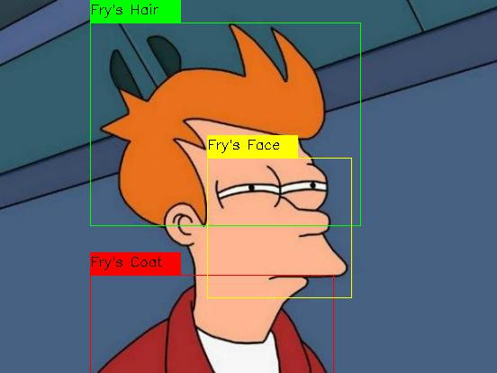

# Image annotation
In this project I use openCV-s drawing features to annotate parts of an image.

##Requirements
- openCV 4.5.5

##Usage

Just run the image_annotation.py file, and it should annotate the fry.jpg image.

Start:

 

Result:

 
